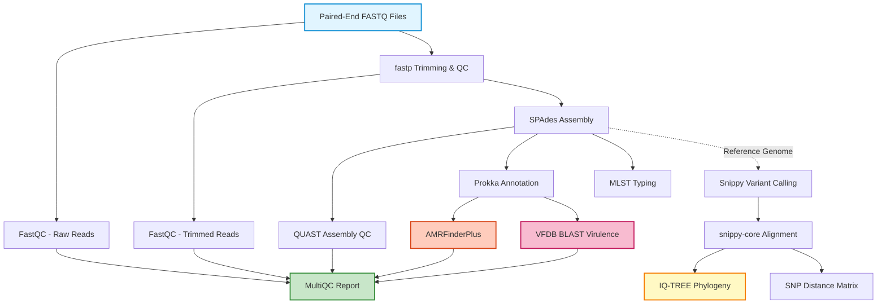

# Bacterial Genome Analysis Pipeline

A comprehensive Nextflow pipeline for analyzing bacterial genomes from Illumina paired-end reads, performing quality control, assembly, AMR detection, phylogenetic analysis, and virulence factor identification.

## Features

- **Quality Control**: FastQC and fastp for read quality assessment and trimming
- **Assembly**: SPAdes de novo assembly with QUAST quality metrics
- **Annotation**: Prokka genome annotation
- **AMR Detection**: AMRFinderPlus for antimicrobial resistance gene identification
- **Virulence**: BLAST against VFDB for virulence factor detection
- **MLST**: Multi-locus sequence typing
- **Phylogeny**: Core genome SNP-based phylogenetic tree construction
- **Reporting**: MultiQC consolidated reports

## Pipeline Workflow

The pipeline processes bacterial genome data through the following stages:



**Legend:**
- 🔵 **Blue** - Input data
- 🟢 **Green** - Final outputs and reports
- 🟡 **Yellow** - Phylogenetic analysis
- 🟠 **Orange** - AMR detection
- 🔴 **Pink** - Virulence detection
- **Dashed lines** - Optional analysis (requires reference genome)

## Requirements

### Software
- Nextflow >= 22.10.0
- Docker or Singularity (recommended)
- OR all bioinformatics tools installed locally

### Hardware Recommendations
- **Minimum**: 8 CPUs, 32 GB RAM
- **Recommended**: 16 CPUs, 128 GB RAM

## Quick Start

### 1. Install Nextflow

```bash
curl -s https://get.nextflow.io | bash
sudo mv nextflow /usr/local/bin/
```

### 2. Prepare Input Samplesheet

Create a CSV file with your samples:

```csv
sample,read1,read2
sample1,/path/to/sample1_R1.fastq.gz,/path/to/sample1_R2.fastq.gz
sample2,/path/to/sample2_R1.fastq.gz,/path/to/sample2_R2.fastq.gz
sample3,/path/to/sample3_R1.fastq.gz,/path/to/sample3_R2.fastq.gz
```

### 3. Run the Pipeline

**Basic usage (without phylogeny):**
```bash
nextflow run main.nf \
  --input samplesheet.csv \
  --outdir results \
  -profile docker
```

**Full analysis with phylogeny:**
```bash
nextflow run main.nf \
  --input samplesheet.csv \
  --outdir results \
  --reference reference_genome.fasta \
  -profile docker
```

## Parameters

### Required
| Parameter | Description |
|-----------|-------------|
| `--input` | Path to CSV samplesheet with sample information |
| `--outdir` | Path to output directory |

### Optional
| Parameter | Default | Description |
|-----------|---------|-------------|
| `--reference` | null | Reference genome for phylogeny (FASTA) |
| `--vfdb` | null | Path to VFDB database (auto-downloaded if not provided) |
| `--skip_phylogeny` | false | Skip phylogenetic analysis |
| `--skip_mlst` | false | Skip MLST typing |
| `--fastp_qualified_quality_phred` | 20 | Minimum quality score for fastp filtering |
| `--fastp_min_length` | 50 | Minimum read length after trimming |
| `--spades_kmers` | auto | K-mer sizes for SPAdes assembly |
| `--multiqc_title` | 'Bacterial Genome Analysis Report' | Title for MultiQC report |

### Resource Limits
| Parameter | Default |
|-----------|---------|
| `--max_cpus` | 16 |
| `--max_memory` | 128.GB |
| `--max_time` | 240.h |

## Output Structure

```
results/
├── fastqc/              # FastQC reports (raw and trimmed)
├── fastp/               # fastp trimming reports
├── assembly/            # SPAdes assemblies
├── quast/               # Assembly quality metrics
├── annotation/          # Prokka annotations
├── amr/                 # AMR resistance genes
├── virulence/           # Virulence factors
├── mlst/                # MLST typing results
├── phylogeny/           # Phylogenetic tree and SNP distances
│   ├── snippy/          # Per-sample variant calls
│   ├── core.aln         # Core genome alignment
│   ├── core.aln.treefile # Phylogenetic tree (Newick format)
│   └── snp_distances.tsv # Pairwise SNP distances
├── multiqc/             # Consolidated QC report
└── pipeline_info/       # Pipeline execution reports
```

## Profiles

The pipeline includes several execution profiles:

- **`docker`**: Run with Docker containers (recommended)
- **`singularity`**: Run with Singularity containers
- **`local`**: Run without containers (requires all tools installed)
- **`slurm`**: Submit jobs to SLURM cluster
- **`test`**: Small-scale testing with reduced resources

Example:
```bash
nextflow run main.nf --input samples.csv --outdir results -profile docker
```

## Understanding Results

### AMR Detection
- **Location**: `results/amr/`
- Each sample has a `*_amr.tsv` file with detailed AMR gene predictions
- `*_amr_summary.txt` provides a quick overview of detected resistance genes

### Virulence Factors
- **Location**: `results/virulence/`
- `*_virulence.tsv` contains BLAST hits against VFDB
- `*_virulence_summary.txt` lists virulence factors with >70% identity

### Phylogeny
- **Location**: `results/phylogeny/`
- `core.aln.treefile` is the phylogenetic tree (view with FigTree, iTOL, etc.)
- `snp_distances.tsv` shows pairwise SNP distances between samples

### MultiQC Report
- **Location**: `results/multiqc/multiqc_report.html`
- Open this HTML file in a web browser for an interactive dashboard
- Aggregates QC metrics from all pipeline steps

## Troubleshooting

### Memory Issues
If SPAdes runs out of memory:
```bash
nextflow run main.nf --input samples.csv --outdir results --max_memory 64.GB
```

### Container Issues
If containers fail to pull, try:
```bash
# For Docker
docker pull staphb/spades:3.15.5

# For Singularity
singularity pull docker://staphb/spades:3.15.5
```

### Pipeline Resumption
If the pipeline fails, you can resume from where it stopped:
```bash
nextflow run main.nf --input samples.csv --outdir results -resume
```

## Citation

If you use this pipeline, please cite the tools:

- **Nextflow**: Di Tommaso et al. (2017) Nature Biotechnology
- **FastQC**: Andrews S. (2010) Babraham Bioinformatics
- **fastp**: Chen et al. (2018) Bioinformatics
- **SPAdes**: Bankevich et al. (2012) Journal of Computational Biology
- **Prokka**: Seemann (2014) Bioinformatics
- **AMRFinderPlus**: Feldgarden et al. (2021) Scientific Reports
- **VFDB**: Chen et al. (2005) Nucleic Acids Research
- **mlst**: Seemann T. (GitHub: tseemann/mlst)
- **Snippy**: Seemann T. (GitHub: tseemann/snippy)
- **IQ-TREE**: Nguyen et al. (2015) Molecular Biology and Evolution
- **MultiQC**: Ewels et al. (2016) Bioinformatics

## License

This pipeline is distributed under the MIT License.

## Support

For issues and questions, please open an issue on the repository.
